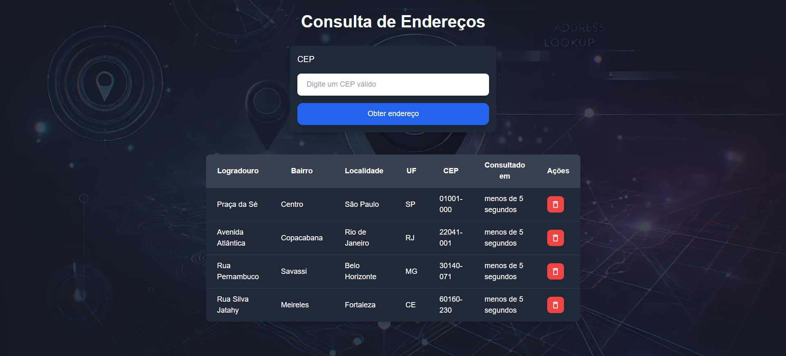

# Consulta de Endereço por CEP

Este é um projeto onde é possível buscar informações do endereço utilizando o CEP. A consulta é realizada através de uma API que retorna os dados do endereço, como rua, bairro, cidade, estado, entre outros.

## Screenshot do Projeto

## Tecnologias Utilizadas

- **React** / **Next.js**: Frameworks utilizados para o desenvolvimento da interface e da aplicação web.
- **Tailwind CSS**: Framework de CSS para estilização responsiva e customizada.
- **Framer Motion**: Biblioteca para animações fluidas e interações.
- **Node Modules**: Pacotes e dependências para facilitar o desenvolvimento, incluindo bibliotecas necessárias para o funcionamento da aplicação.

### Principais Funcionalidades

- **Input de CEP**: Permite que o usuário insira o CEP para consulta.
- **API de Consulta**: Utiliza uma API para buscar os dados do endereço baseado no CEP informado.
- **Animações com Framer Motion**: As transições de tela e animações de entrada dos dados utilizam o Framer Motion para melhorar a experiência do usuário.
- **Layout Responsivo**: Utiliza o Tailwind CSS para garantir uma interface responsiva, adaptando-se a diferentes tamanhos de tela.

## Requisitos

Para executar este projeto, você precisará ter o **Node.js** instalado.

## Como Rodar o Projeto

- Clone o repositório em sua máquina local (git clone);
- Instale as dependências (npm i);
- Rode o projeto (npm run dev);
